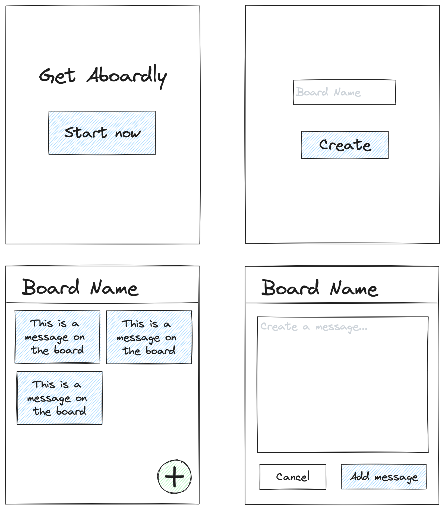

+++
title = 'DevLog #1: Aboardly Creation'
date = 2024-01-01T22:42:43-03:00
draft = false
tags = ['devlog']
+++

Over the past few weeks I've been reading about HTMX, and I've been studying Go through various courses and books (like "Cloud Native Go"). I just thought of creating a project where I could use both together. I also wanted to create something nice that could be used by anyone, so that's where Aboardly comes in.

Aboardly is a simple message board webapp where you can create a board and share it with friends to create and reply to messages. It'll start as a webapp to create public boards but the idea is to have some kind of private board (password protected) too. I also want to include some websockets in the mix to add realtime updates to the boards.

## Tech

The idea of this project is to improve my Go skills and learn more about HTMX and its capabilities, so the technologies of choice are:

- Go programming language
- Gorilla Mux for routing
- html/template standard library for templating
- HTMX library to powerup the webapp
- sqlite as the database

I will not use any ORM as I prefer to write the SQL queries on my own.

## Wireframe

Here a simple wireframe of what I have in mind:

